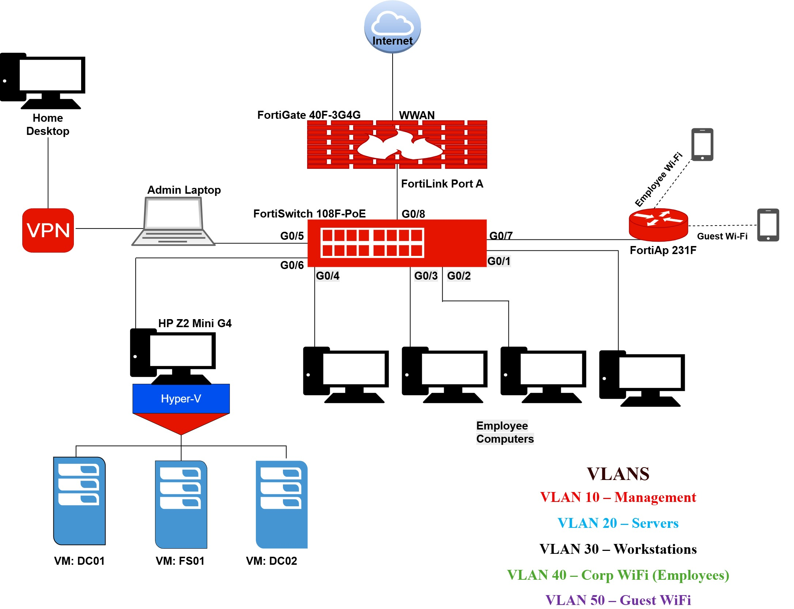
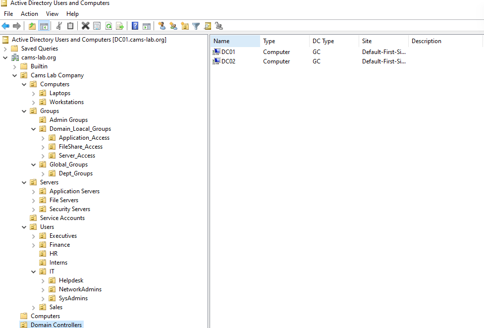
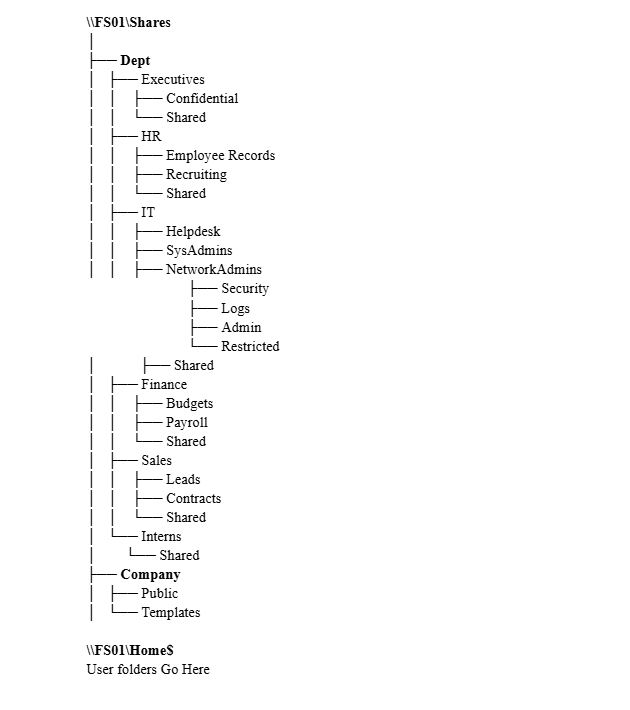
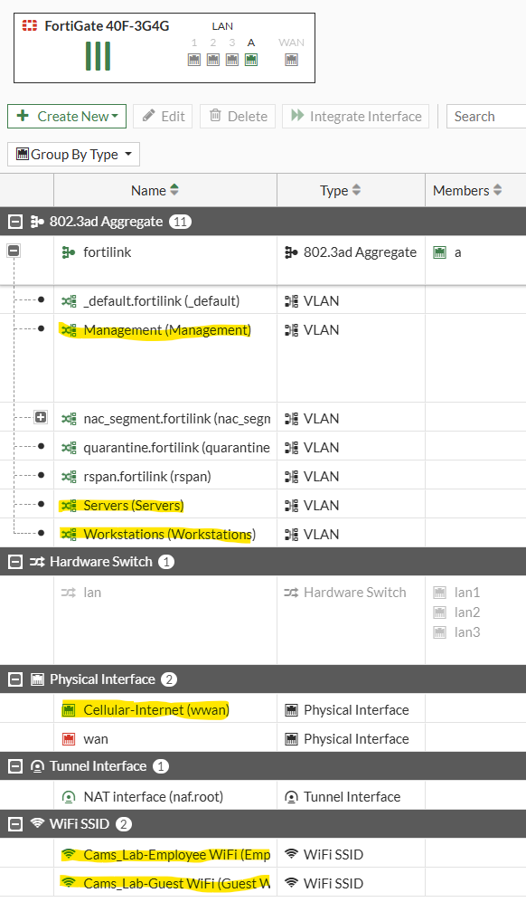
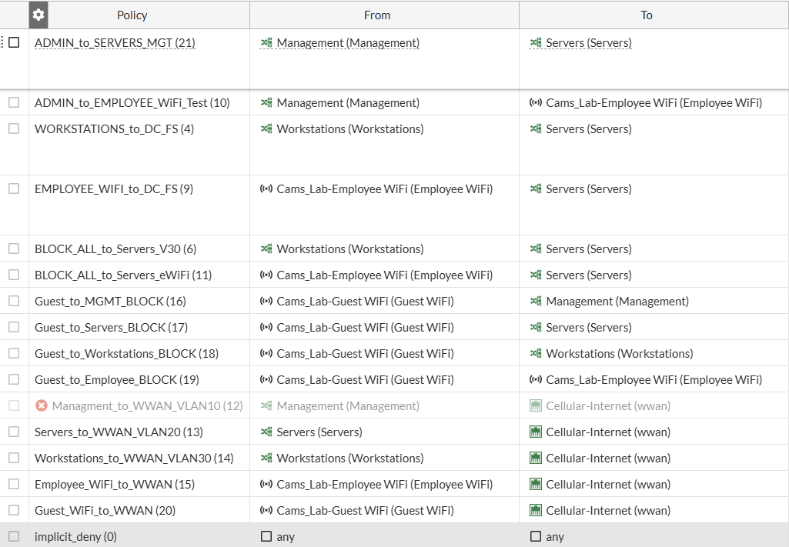
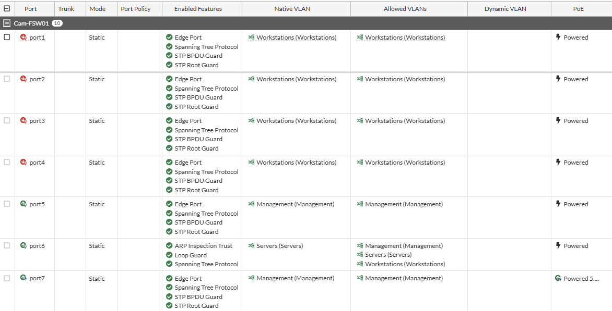

 
  

 
<h1>Enterprise Network & Systems Administration Project</h1>
<h2>Environments and Technologies Used</h2>

- Fortinet FortiGate Firewall
- Fortinet FortiSwitch
- Fortinet FortiAP (Wireless)
- Microsoft Hyper-V
- Windows Server
- Active Directory Domain Services
- DNS
- DHCP
- Group Policy
- File Services
- VLAN Segmentation

<h2>Operating Systems Used</h2>

- Windows Server
- Windows Client OS

<h2>Project Overview</h2>

This project is a fully designed enterprise-style infrastructure environment built to simulate real-world network and systems administration.

The environment demonstrates centralized identity management, secure network segmentation, role-based access control, and structured file services using industry standard enterprise technologies.

This lab includes:

- Active Directory domain infrastructure
- Redundant domain controllers
- DNS and DHCP services
- Department-based file storage
- Group Policy deployment
- VLAN network segmentation
- Firewall-controlled inter-VLAN routing
- Administrative delegation model
- Least-privilege security design

The objective is to build, secure, and manage a scalable enterprise environment from the network layer through identity and access control.

<h2>Part 1 — Physical & Network Architecture</h2>

The infrastructure is built around a layered network model:
- FortiGate performs routing and security policy enforcement
- FortiSwitch provides access layer connectivity
- FortiAP delivers segmented wireless networks
- Hyper-V hosts the virtual server infrastructure
Network segmentation is implemented using VLANs:

| VLAN | Purpose            |
|------|-------------------|
| 10   | Management        |
| 20   | Servers           |
| 30   | Workstations      |
| 40   | Corporate Wireless|
| 50   | Guest Wireless    |

Traffic between networks is controlled through firewall policy using least-privilege principles.

 

<h2>Part 2 — Virtual Server Infrastructure (Hyper-V)</h2>

Virtual machines were deployed to provide enterprise services:
- Domain Controller 1 (Primary)
- Domain Controller 2 (Redundancy)
- File Server
- Domain-joined Client workstation

Each system was assigned appropriate network segmentation and configured for domain integration.

<h2>Part 3 — Active Directory Domain Services Deployment</h2>

The domain environment was created to centralize authentication, authorization, and policy management.

Configuration included:
- Forest and domain creation
- Organizational Unit structure
- Administrative delegation
- Security group hierarchy
- Domain controller redundancy

<h2>Part 4 — Identity & Access Management Model</h2>

Access control follows a structured group nesting strategy to support scalable permission management.
Implementation includes:
- Role-based security groups
- Departmental access separation
- Administrative privilege delegation
- Least-privilege enforcement

  

<h2>Part 5 — File Services & Department Storage</h2>

Centralized file storage was implemented using structured share design.

Configuration includes:
- Department file shares
- User home directories
- NTFS permission enforcement
- Share permission alignment
- Group-based access control

  

<h2>Part 6 — Group Policy Deployment</h2>

Group Policy was used to standardize configuration and automate resource access.

Policies include:
- Drive mapping for department shares
- Home directory mapping
- User configuration management
- Administrative control settings

  

<h2>Part 7 — Network Segmentation & Firewall Policy</h2>

Network traffic is controlled using VLAN gateways and firewall rules.

- Security controls include:
- Restricted workstation-to-server communication
- Administrative network isolation
- Guest network isolation
- Controlled inter-VLAN routing

   

   

<h2>Part 8 — Switch Infrastructure</h2>

The access layer enforces VLAN membership and device segmentation.

Configuration includes:
- Access ports
- Trunk links
- VLAN tagging
- Network role separation

   

<h2>Part 9 — Wireless Network Segmentation</h2>

Wireless networks are mapped to VLANs to enforce security boundaries.

Networks include:
- Corporate wireless network
- Guest wireless network
- Segmented traffic routing

<h2>Security Design</h2>

Security controls implemented across the environment:
- Network segmentation
- Role-based permissions
- Administrative privilege separation
- Restricted lateral movement
- Controlled resource access

<h2>Key Skills Demonstrated</h2>

Enterprise infrastructure deployment
- Active Directory administration
- Network segmentation design
- Identity and access management
- File services architecture
- Policy-based configuration management
- Firewall rule implementation
- Virtual server infrastructure management
- Enterprise documentation practices

<h2>Project Status</h2>

Active development and ongoing expansion.

Future additions may include:
- RADIUS Server Implementation
- FortiGate HA Pair Implentation
- VPN tunnel Implentation
- Monitoring and alerting systems
- Backup and recovery automation
- Identity federation integration
- Security auditing and logging
